# STRIDE — Aufgaben-Tracker & Zeitmanagement

> 📖 **Dokumentation:** [Deutsch](README.md) | [English](README.en.md)

---

**STRIDE** ist eine mobile App zum Planen und Verfolgen alltäglicher Aufgaben. 📋 Mit ihr lassen sich Prioritäten setzen, Termine planen und wiederkehrende Tätigkeiten organisieren.

---

## Über das Projekt

STRIDE unterstützt bei der Planung von Tag und Woche: Aufgaben werden Datum und Uhrzeit zugeordnet, wiederkehrende Ereignisse (täglich, wochentags, wöchentlich, monatlich, jährlich) können definiert und der Fortschritt über die Wochenübersicht mit Fortschrittsbalken pro Tag verfolgt werden.

---

## Demonstration

### Video-Übersicht
[🎬 Video-Demo ansehen](https://github.com/user-attachments/assets/538492fc-ef4c-467a-9edf-20b6d1bb758c)

### Screenshots
<details>
  <summary>Klicken, um Screenshots anzuzeigen (16 Bilder)</summary>
  <p align="center">
    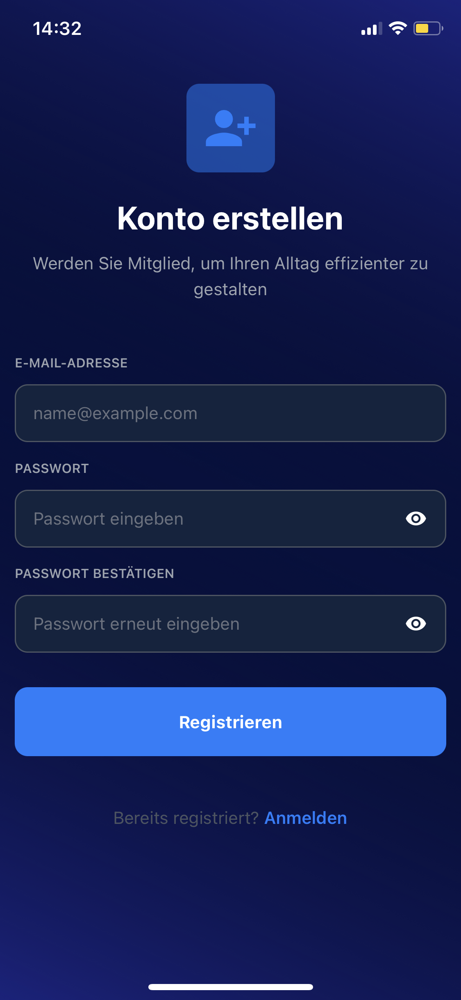
    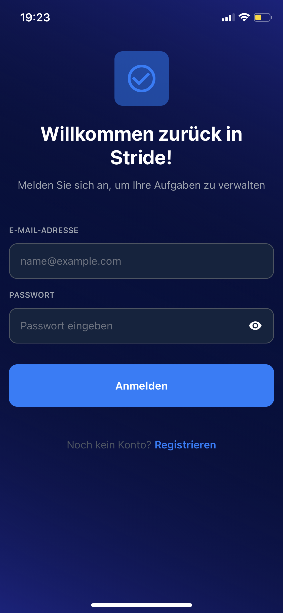
    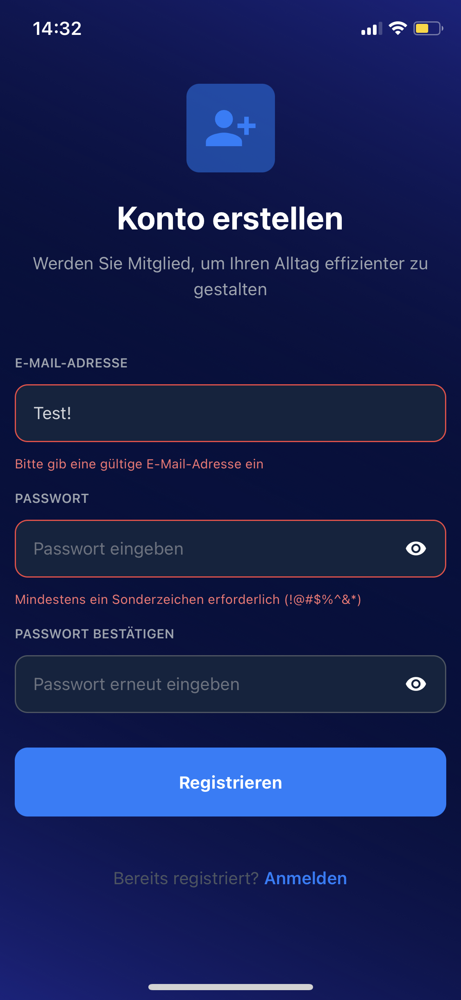
    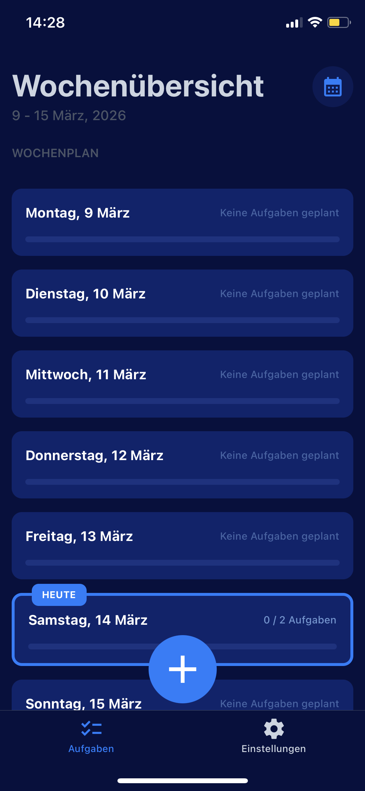
    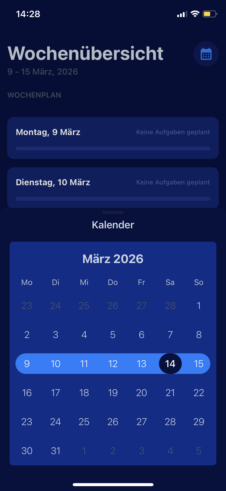
    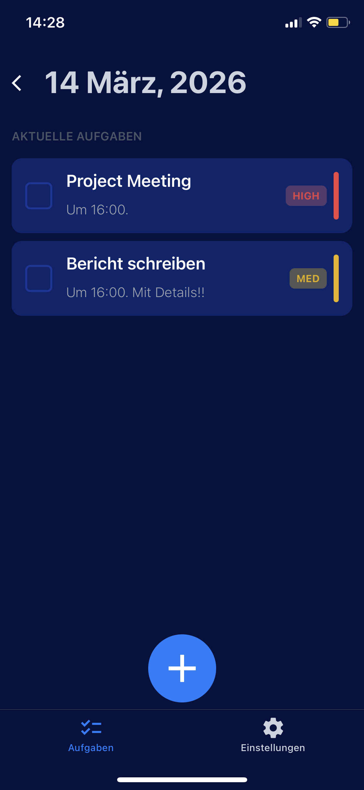
    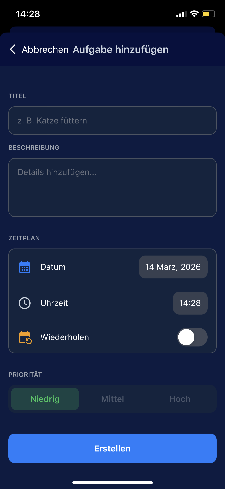
    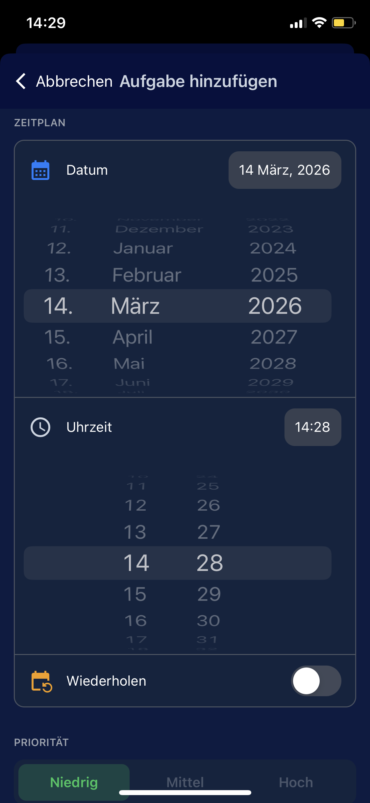
    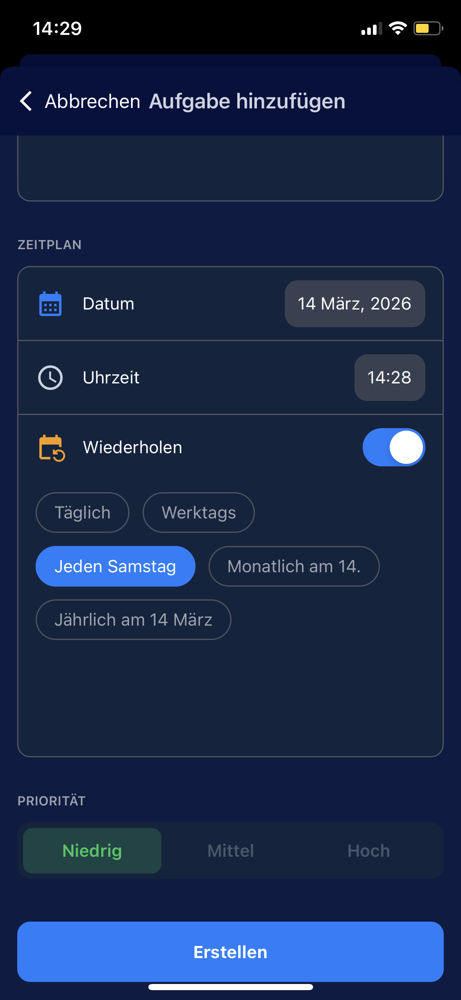
    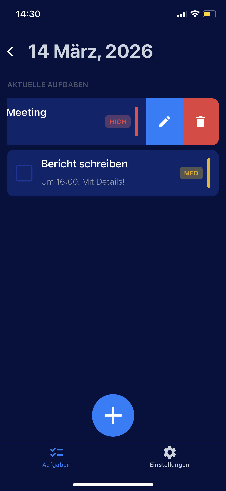
    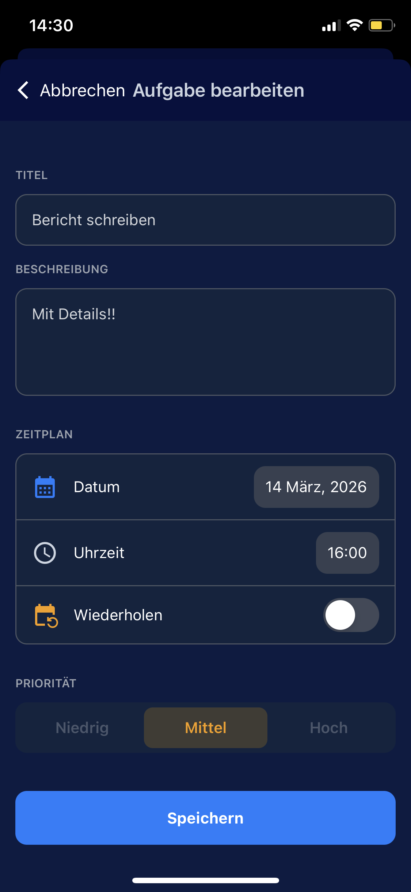
    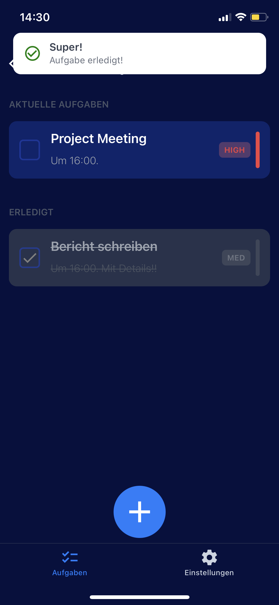
    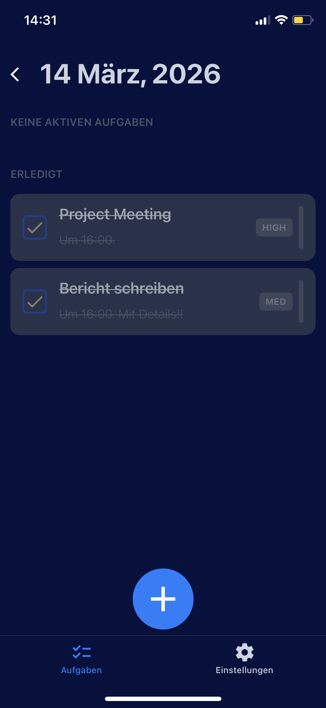
    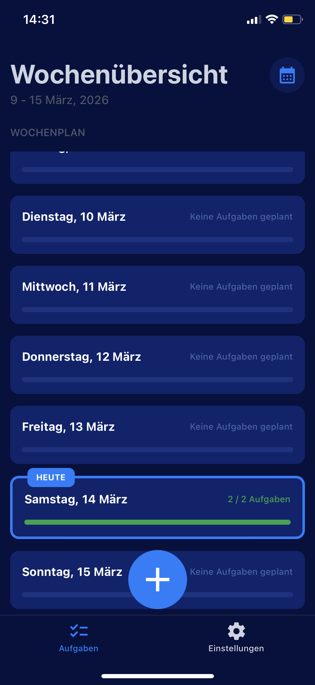
    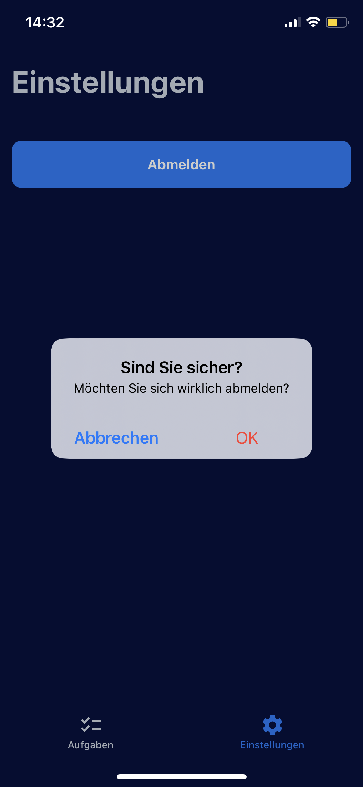
    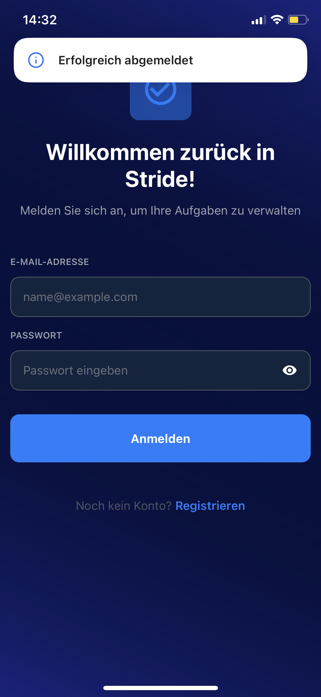
  </p>
</details>

---

## Funktionen

- **Aufgabenverwaltung** — Erstellen, Bearbeiten, Löschen
- **Prioritäten** — Hoch, Mittel, Niedrig
- **Planung** — Datum, Uhrzeit, Wiederholungen (täglich, wochentags, wöchentlich, monatlich, jährlich)
- **Wochenübersicht** — Tageskarten mit Fortschritt (erledigt/gesamt)
- **Tagesdetail** — Liste aktiver und erledigter Aufgaben mit Statusumschaltung
- **Swipe-Aktionen** — Bearbeiten und Löschen per Wischgeste
- **Kalender** — Wochenauswahl und Navigation
- **Authentifizierung** — Firebase Auth (E-Mail/Passwort)
- **Synchronisation** — Speicherung in Firebase Firestore
- **Mehrsprachigkeit** — Deutsch, Englisch, Russisch (i18n + Spracherkennung)
- **Benachrichtigungen** — Toast-Hinweise (sonner-native)

---

## Technologie-Stack

| Kategorie                   | Technologien                                          |
| --------------------------- | ----------------------------------------------------- |
| **Framework**               | React Native + Expo (SDK 54)                          |
| **Navigation**              | Expo Router v6 (file-based routing)                   |
| **Sprache**                 | TypeScript                                            |
| **Styling**                 | NativeWind (Tailwind für React Native)                |
| **Backend**                 | Firebase (Auth, Firestore)                            |
| **Server State**            | TanStack React Query v5                               |
| **Client State**            | Zustand                                               |
| **Formulare & Validierung** | React Hook Form + Zod + @hookform/resolvers           |
| **Internationalisierung**   | i18next + react-i18next + expo-localization           |
| **Datum/Zeit**              | date-fns                                              |
| **Animationen**             | react-native-reanimated, react-native-gesture-handler |
| **UI-Toasts**               | sonner-native                                         |
| **Kalender**                | react-native-calendars                                |

---

## Projektstruktur

```
to-do/
├── app/                          # Routen (Expo Router)
│   ├── _layout.tsx               # Root-Layout (Provider, Stack)
│   ├── authenticate.tsx          # Login/Registrierung
│   └── (protected)/              # Geschützte Routen
│       ├── _layout.tsx           # Auth-Check
│       └── (tabs)/               # Bottom-Tabs
│           ├── _layout.tsx       # Tabs: Aufgaben, Einstellungen
│           ├── (tasks)/          # Tab „Aufgaben“
│           │   ├── index.tsx     # Wochenübersicht (Tageskarten)
│           │   ├── tasks/        # Tagesdetailansicht
│           │   ├── modal-task.tsx    # Modal: Aufgabe erstellen/bearbeiten
│           │   └── modal-calendar.tsx # Modal: Kalender
│           └── settings/         # Einstellungen (Logout)
├── api/                          # API & React Query
│   ├── query-client.ts
│   └── services/
│       └── task.service.ts       # CRUD für Aufgaben (Firestore)
├── components/                   # UI-Komponenten
│   ├── ui/                       # Basis-Elemente (Buttons, Inputs, Checkbox)
│   ├── day-card.tsx              # Tageskarte mit Fortschritt
│   ├── daily-task-item.tsx       # Aufgaben-Element mit Swipe
│   ├── task-card.tsx
│   ├── header.tsx, subheader.tsx
│   └── ...
├── config/
│   └── firebaseConfig.ts         # Firebase-Initialisierung
├── constants/                    # Konstanten (Farben, Prioritäten)
├── hooks/                        # Custom Hooks
│   ├── useAuth.ts
│   ├── useLanguage.ts
│   ├── useDayCards.ts
│   ├── useRepeatOptions.ts
│   └── queryHooks/               # React-Query-Mutationen & -Queries
├── i18n/                         # Internationalisierung
│   ├── i18n.config.ts
│   └── locales/                  # ru.json, en.json, de.json
├── schemas/                      # Zod-Validierungsschemas
├── store/                        # Zustand-Stores (weekStore)
├── types/                        # TypeScript-Typen & Interfaces
├── utilities/                    # Hilfsfunktionen
└── assets/                       # Icons, Splash
```

---

## Installation & Start

### Voraussetzungen

- Node.js 18+
- npm oder yarn
- Expo CLI (über `npx expo`)

### Schritte

1. Repository klonen und Abhängigkeiten installieren:

```bash
git clone <repository-url>
cd to-do
npm install
```

2. Datei `.env` im Projektroot anlegen (Vorlage: `env.example`):

```
API_KEY=...
AUTH_DOMAIN=...
PROJECT_ID=...
STORAGE_BUCKET=...
MESSAGING_SENDER_ID=...
APP_ID=...
```

3. Projekt starten:

```bash
npm start        # Expo Dev Server
npm run android  # Android
npm run ios      # iOS
```

---

## Implementierungsdetails

- **New Architecture** — aktiviert für React Native
- **Typed Routes** — typisierte Routen in Expo Router
- **Edge-to-Edge** — Android Edge-to-Edge-Modus aktiviert
- **Path Aliases** — `@/` für Imports aus dem Projektroot
- **Woche startet Montag** — Montag als erster Wochentag
- **Validierung** — Zod mit übersetzten Fehlermeldungen

---

## Skripte

| Befehl            | Beschreibung            |
| ----------------- | ----------------------- |
| `npm start`       | Expo Dev Server starten |
| `npm run android` | Android-Build           |
| `npm run ios`     | iOS-Build               |

---

## Lizenz

Projekt ist privat.
